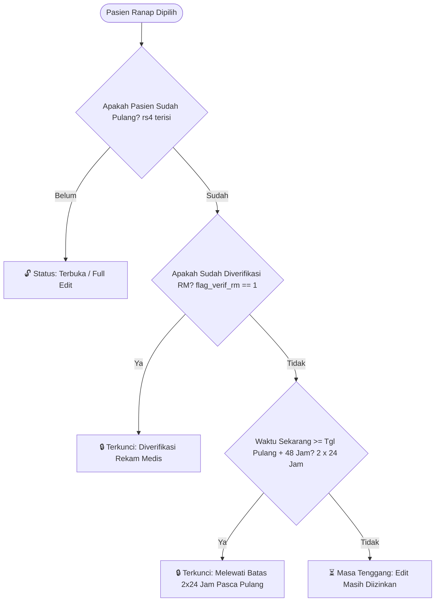

# BLUEPRINT ARSITEKTUR & RENCANA IMPLEMENTASI
## Sistem Penguncian Otomatis Layanan Rawat Inap (Ranap Record Lock System)
### Status: RENCANA / DRAFT (Belum Diterapkan)
**Tanggal Penyusunan:** Oktober 2026  
**Dokumen Referensi:** Standar Akreditasi Rumah Sakit (KARS / JCI) & Good Medical Record Governance  

---

## 1. Latar Belakang & Masalah
Dalam pengelolaan rekam medis elektronik (RME) rawat inap, sering ditemukan ketidaksinkronan data atau perubahan data pelayanan (CPPT, resume, billing, tindakan, surat kematian) oleh user setelah pasien dinyatakan pulang atau setelah berkas diverifikasi oleh tim Rekam Medis (RM/Casemix).

Hal ini berisiko:
1. Menimbulkan sengketa data klaim BPJS / penjamin lain.
2. Melanggar integritas legal rekam medis (audit medis).
3. Tertimpanya data riil kepulangan pasien (seperti kasus pergeseran tanggal pulang `rs4` pada pasien meninggal).

---

## 2. Kriteria Kunci (Locking Criteria)

Halaman pelayanan pasien Ranap akan otomatis beralih ke mode **"TERKUNCI / HANYA BACA (READ-ONLY)"** jika memenuhi **salah satu (OR)** dari 2 kondisi berikut:



### Kondisi 1: Verifikasi Rekam Medis / Casemix (`flag_verif_rm = '1'`)
- Jika berkas sudah divalidasi oleh petugas Rekam Medis di modul Casemix (`listkirimcasmixranap.flag_verif_rm = '1'`), maka **meskipun belum 2x24 jam**, layanan langsung terkunci permanen.
- Alasan bisnis: Berkas sudah masuk tahap verifikasi koding/klaim dan tidak boleh ada perubahan data medis yang mengubah dasar koding ICD-10 / ICD-9CM.

### Kondisi 2: Batas Waktu 2 × 24 Jam Pasca Kepulangan (`rs4 + 48 Jam`)
- Jika pasien sudah dipulangkan (`rs23.rs4` terisi atau status pulang `rs22 = '3'`), sistem menghitung selisih waktu:
  $$\Delta t = \text{Waktu Sekarang} - \text{Tanggal Pulang Pasien}$$
- Jika $\Delta t \ge 48\text{ jam}$ (2 x 24 jam), sistem otomatis mengunci seluruh form layanan secara real-time.

---

## 3. Pilihan Strategi Implementasi di Frontend (Quasar / Vue 3)

Tantangan di SIMRS adalah banyaknya menu pelayanan (CPPT, Tindakan, Asesmen, Billing, Resume, Penunjang, dll). Jika harus menambahkan `:disabled="isLocked"` pada ratusan tombol satu per satu, ini rawan terlewat dan tidak efisien.

Berikut 3 opsi praktis dengan perbandingan arsitekturalnya:

| Parameter | Opsi A: Smart Wrapper Container (Direkomendasikan ⭐) | Opsi B: Pinia Store / Provide-Inject Helper | Opsi C: Custom Vue Directive (`v-record-lock`) |
| :--- | :--- | :--- | :--- |
| **Cara Kerja** | Di layout utama layanan, konten dibungkus wrapper CSS/pointer guard jika terkunci + Banner sticky di atas. | Setiap sub-komponen membaca getter `isLocked` dari store dan men-disable form/tombol. | Menambahkan direktif pada tombol/elemen input: `<q-btn v-record-lock ... />`. |
| **Kecepatan Penerapan** | **Sangat Cepat & Menyeluruh** (Cukup di 1 layout induk). | Butuh edit banyak file sub-komponen satu per satu. | Butuh menyisipkan directive ke setiap tombol. |
| **Resiko Terlewat** | 0% (semua tombol aksi otomatis terlindungi). | Tinggi (ada kemungkinan tombol baru lupa di-disable). | Sedang-Tinggi. |
| **User Experience** | Sangat elegan: banner informasi jelas, preview form tetap bersih dan bisa dicetak/dibaca. | Tombol abu-abu/disabled satu per satu. | Tombol hilang atau disabled. |

---

### Detail Desain Opsi A: "Smart Wrapper & Institutional Glass Banner" (Standar Internasional)

#### A. Tampilan Banner Status Terkunci (Sticky Top Notification)
Saat halaman layanan dibuka dan status terkunci, di bagian atas muncul banner profesional:

> 🔒 **REKAM MEDIS TERKUNCI (HANYA BACA)**  
> *Berkas pelayanan pasien ini telah dikunci pada [Tanggal/Waktu] karena: **Telah melewati batas waktu 2x24 jam sejak pasien dipulangkan** / **Telah diverifikasi oleh Instalasi Rekam Medis**.*  
> Seluruh data hanya dapat dilihat dan dicetak. Hubungi Tim Rekam Medis jika memerlukan pembukaan kunci koreksi resmi.

#### B. Logika Dinamis di Store Pinia / Layout Ranap
```javascript
// Getter di store pasien / ranap
const isRecordLocked = computed(() => {
  if (!pasien.value) return false
  
  // 1. Cek Verifikasi RM
  if (pasien.value.flag_verif_rm === '1' || pasien.value.flag_verif_rm === 1) {
    return { locked: true, reason: 'Berkas telah diverifikasi oleh Rekam Medis' }
  }
  
  // 2. Cek 2 x 24 jam pasca pulang
  if (pasien.value.tgl_keluar || pasien.value.tglpulang || pasien.value.rs4) {
    const tglPulang = new Date(pasien.value.tgl_keluar || pasien.value.tglpulang || pasien.value.rs4)
    const now = new Date()
    const diffHours = (now - tglPulang) / (1000 * 60 * 60)
    
    if (diffHours >= 48) {
      return { locked: true, reason: 'Telah melewati batas toleransi 2x24 jam pasca kepulangan' }
    }
  }
  
  return { locked: false, reason: '' }
})
```

#### C. Teknik Pointer Guard & Form Freeze (CSS Cerdas)
Di wrapper konten pelayanan ranap:
```vue
<template>
  <div class="halaman-layanan-ranap">
    <!-- Banner Pemberitahuan Status Kunci -->
    <div v-if="lockStatus.locked" class="banner-record-locked q-pa-sm q-mb-md">
      <div class="row items-center q-gutter-x-sm">
        <q-icon name="lock" size="sm" color="negative" />
        <div class="col">
          <div class="text-weight-bold text-negative">REKAM MEDIS TERKUNCI (READ-ONLY)</div>
          <div class="text-caption text-grey-8">{{ lockStatus.reason }}. Seluruh fungsi pengisian data dinonaktifkan.</div>
        </div>
        <!-- Tombol Khusus Request Buka Kunci (Opsional) -->
        <q-btn v-if="bisaAjukanBukaKunci" flat dense color="primary" label="Ajukan Buka Kunci" @click="bukaDialogBukaKunci" />
      </div>
    </div>

    <!-- Konten Layanan (CPPT, Tindakan, Asesmen, dll) -->
    <div :class="{ 'layanan-locked-container': lockStatus.locked }">
      <router-view :is-locked="lockStatus.locked" />
    </div>
  </div>
</template>

<style scoped>
/* Saat terkunci, tombol simpan/hapus/edit tidak bisa diklik */
.layanan-locked-container :deep(.btn-simpan),
.layanan-locked-container :deep(.btn-hapus),
.layanan-locked-container :deep(button[type="submit"]),
.layanan-locked-container :deep(.q-btn--action-save) {
  pointer-events: none !important;
  opacity: 0.45 !important;
  cursor: not-allowed !important;
  filter: grayscale(1);
}

/* Form input dibuat readonly/non-editable visual */
.layanan-locked-container :deep(.q-field--standard:not(.allow-read)),
.layanan-locked-container :deep(.q-field--outlined:not(.allow-read)) {
  pointer-events: none;
  background-color: rgba(245, 245, 245, 0.6);
}

/* Pengecualian: Tombol Print, Preview PDF, Tab navigasi, dan Scrollbar tetap 100% aktif */
.layanan-locked-container :deep(.btn-print),
.layanan-locked-container :deep(.q-tabs),
.layanan-locked-container :deep(.q-tab) {
  pointer-events: auto !important;
  opacity: 1 !important;
}
</style>
```

---

## 4. Lapisan Keamanan Backend (Laravel API Enforcement)

Frontend saja **tidak cukup** karena user berpengalaman masih bisa mengirim HTTP POST/PUT via tools lain atau script console. Untuk keamanan absolut:

### A. Buat Middleware Laravel: `CheckRanapRecordLock.php`
```php
namespace App\Http\Middleware;

use Closure;
use Illuminate\Http\Request;
use Carbon\Carbon;
use Illuminate\Support\Facades\DB;

class CheckRanapRecordLock
{
    public function handle(Request $request, Closure $next)
    {
        // Hanya validasi request manipulasi data (POST, PUT, DELETE, PATCH)
        if (in_array($request->method(), ['POST', 'PUT', 'DELETE', 'PATCH'])) {
            $noreg = $request->input('noreg') ?? $request->route('noreg');
            
            if ($noreg) {
                // 1. Cek apakah sudah diverifikasi Rekam Medis (Casemix)
                $verifRm = DB::table('listkirimcasmixranap')
                    ->where('noreg', $noreg)
                    ->where('flag_verif_rm', '1')
                    ->exists();

                if ($verifRm) {
                    return response()->json([
                        'message' => 'Gagal menyimpan: Rekam medis pasien ini telah diverifikasi oleh Tim Rekam Medis dan terkunci permanen.'
                    ], 423); // 423 Locked
                }

                // 2. Cek apakah sudah lewat 2 x 24 jam sejak pulang
                $kunjungan = DB::table('rs23')
                    ->select('rs4', 'rs22')
                    ->where('rs1', $noreg)
                    ->first();

                if ($kunjungan && !empty($kunjungan->rs4) && $kunjungan->rs4 != '0000-00-00 00:00:00') {
                    $tglPulang = Carbon::parse($kunjungan->rs4);
                    if (Carbon::now()->diffInHours($tglPulang) >= 48) {
                        return response()->json([
                            'message' => 'Gagal menyimpan: Batas waktu pengisian/revisi rekam medis (2x24 jam setelah pasien pulang) telah habis.'
                        ], 423); // 423 Locked
                    }
                }
            }
        }

        return $next($request);
    }
}
```

### B. Mendaftarkan Middleware ke Route Pelayanan Ranap
Di `routes/api.php`:
```php
Route::middleware(['auth:sanctum', 'check.ranap.lock'])->group(function () {
    // Seluruh rute simpan pelayanan ranap (CPPT, resume, billing, tindakan, dll)
});
```

---

## 5. Fitur "Break-the-Glass" / Dispensasi Pembukaan Kunci Resmi (Enterprise Standard)

Dalam operasional rumah sakit, selalu ada kasus insidental (misalnya: hasil lab kultur darah baru keluar hari ke-4 dan DPJP wajib menuliskan asesmen akhir). 

Solusi enterprise internasional: **TIDAK DENGAN MENGEDIT DATABASE MANUAL**, melainkan melalui modul izin buka kunci:

1. **Tombol "Ajukan Pembukaan Kunci Berkas"**:
   - Dokter/perawat mengisi alasan pengajuan (contoh: *"Revisi resume dokter spesialis konsul baru"*).
2. **Otorisasi Tim Rekam Medis / Kepala Ruangan / Komite Medis**:
   - Tim Rekam Medis dapat memberikan izin unlock sementara: misal **berlaku selama 2 jam / 6 jam**.
3. **Audit Trail Lengkap**:
   - Sistem mencatat: Siapa yang meminta, siapa yang menyetujui, jam berapa kunci dibuka, dan kolom apa saja yang diedit selama masa dispensasi tersebut.

---

## 6. Tahapan Eksekusi Jika Rencana Disetujui (Implementation Roadmap)

1. **Fase 1 (Backend Foundation):**
   - Buat tabel/kolom flag lock override jika perlu dispensasi.
   - Siapkan helper & middleware `CheckRanapRecordLock`.
   - Pastikan endpoint `index`/detail pasien ranap selalu menyertakan atribut `is_locked`, `lock_reason`, dan `flag_verif_rm`.

2. **Fase 2 (Frontend Layer):**
   - Tambahkan getter reaktif `isLocked` di Pinia store pasien ranap.
   - Pasang Banner Kunci & Smart Pointer Guard di layout induk layanan rawat inap.
   - Uji coba tombol Print/PDF dan navigasi tab agar tetap berfungsi sempurna.

3. **Fase 3 (Sosialisasi & Uji Coba Terbatas):**
   - Uji coba di 1 ruangan rawat inap sebelum diterapkan secara menyeluruh ke seluruh SIMRS.
